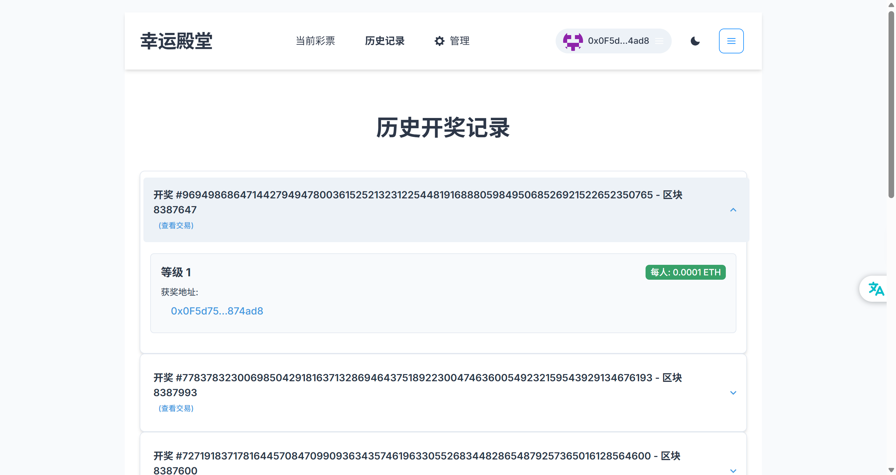

# Web3Ticket - 我的抽奖应用 (My Lottery App)

欢迎来到 Web3Ticket！这是一个基于 Web3 技术的去中心化抽奖前端应用。用户可以通过此应用与部署在区块链上的抽奖智能合约进行交互。

 


## ✨ 功能特性 (Features)

*   连接 Web3 钱包 (例如 MetaMask)
*   查看当前可参与的抽奖活动
*   购买抽奖彩票
*   使用 Chainlink VRF 保证抽奖的公平性和随机性
*   查看历史抽奖结果
*   (根据你的项目具体功能，可以添加更多特性，例如：管理员创建和管理抽奖活动等)

## 🛠️ 技术栈 (Tech Stack)

*   **前端框架**: React
*   **构建工具**: Vite
*   **包管理器**: npm
*   **Web3 集成**: ethers.js (或 web3.js), Chainlink VRF
*   **目标区块链**: Ethereum
*   **UI 库/组件**: chakra-ui

## 🚀 开始使用 (Getting Started)

### 前提条件 (Prerequisites)

在开始之前，请确保你已经安装了以下软件：

*   Node.js (推荐 v16.x 或更高版本)
*   npm (通常随 Node.js 一起安装) 或 yarn
*   一个支持 Web3 的浏览器或浏览器扩展，例如 MetaMask

### 安装 (Installation)

1.  **克隆仓库** (如果项目已在版本控制中):
    ```bash
    git clone <你的仓库URL>
    cd d:\project\Front\web3Ticket\my-lottery-app
    ```
    如果项目是本地创建的，直接进入项目目录 `d:\project\Front\web3Ticket\my-lottery-app`。

2.  **安装项目依赖**:
    打开终端，进入项目根目录 `d:\project\Front\web3Ticket\my-lottery-app\`，然后运行：
    ```bash
    npm install
    ```
    或者，如果你使用 yarn：
    ```bash
    yarn install
    ```

3.  **配置环境变量**:
    在项目根目录 `d:\project\Front\web3Ticket\my-lottery-app\` 下，你可能需要创建一个 `.env.local` 文件来配置环境变量。如果项目中有 `.env.example` 文件，可以复制它并重命名为 `.env.local`。

    **重要：Chainlink VRF 配置**
    本项目的抽奖智能合约依赖 **Chainlink VRF (Verifiable Random Function)** 来获取可验证的随机数，以确保抽奖的公平性。因此，在与合约交互（特别是创建抽奖或执行抽奖环节）之前，你需要完成以下 Chainlink VRF 的配置步骤：

    1.  **创建 VRF 订阅 (Create VRF Subscription)**:
        *   访问 Chainlink VRF 订阅页面 (请确保选择了正确的测试网或主网)。
        *   创建一个新的订阅。

    2.  **为订阅充值 LINK (Fund Subscription with LINK)**:
        *   你的订阅需要有足够的 LINK 代币来支付请求随机数所产生的费用。
        *   将 LINK 代币转入你的订阅账户。

    3.  **添加消费者 (Add Consumer)**:
        *   将你部署的抽奖智能合约地址添加为你 VRF 订阅的消费者 (Consumer)。这样，你的合约才有权限从该订阅请求随机数。

    例如：
    ```env
    # .env.local
    VITE_APP_TITLE="Web3Ticket Lottery"
    VITE_CONTRACT_ADDRESS="你的抽奖智能合约地址"
    # 根据你的项目需要，添加其他必要的环境变量
    ```
    *重要提示: `.gitignore` 文件已配置忽略 `.env` 和 `.env*.local` 文件，这意味着这些包含敏感信息或本地配置的文件不会被提交到 Git 仓库。*

### 运行开发服务器 (Running in Development)

配置完成后，你可以启动本地开发服务器：

```bash
npm run dev
```
或者，如果你使用 yarn：
```bash
yarn dev
```
应用通常会在 `http://localhost:5173` (Vite 默认端口) 或你在 `vite.config.js` (或 `.ts`) 中配置的其他端口上运行。在浏览器中打开此地址即可查看应用。

### 构建生产版本 (Building for Production)

当你准备好部署应用时，可以构建生产优化版本：

```bash
npm run build
```
或者，如果你使用 yarn：
```bash
yarn build
```
构建产物会生成在项目根目录下的 `dist` 文件夹 (`d:\project\Front\web3Ticket\my-lottery-app\dist\`) 中。这个 `dist` 目录包含了所有静态资源，可以部署到任何静态文件托管服务上。

## 🧹 代码检查与格式化 (Linting and Formatting)

如果你的项目配置了 ESLint, Prettier 或其他代码检查/格式化工具，请在此处说明如何运行它们。例如：
```bash
# npm run lint
# npm run format
```

## 🤝 贡献 (Contributing)

如果你想为这个项目做出贡献，请遵循标准的 Fork & Pull Request 工作流程。任何贡献都将受到欢迎！

## 📄 许可证 (License)

本项目采用Apache License